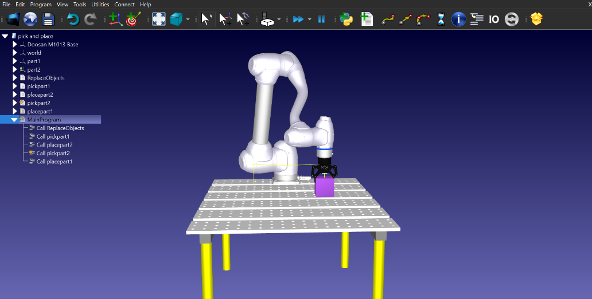
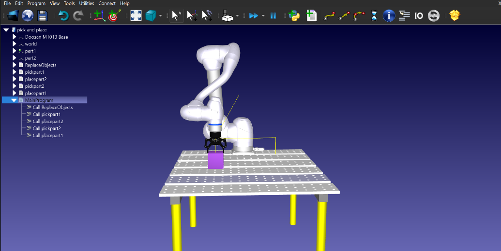

# Inverse-kinematic-modeling-using-robo-analyzer-

 
## AIM: 
To analyze the inverse kinematics using DH parameters for a 3 dof planer and 3 dof articulated robot using roboanalyzer and polt the graph of joint angle for a given  input end effector position .


### COMPONENTS REQUIRED:
1.Robo analyzer software  


### THEORY: 
  
### Inverse Kinematics
 

Inverse kinematics is the use of kinematic equations to determine the motion of a robot to reach a desired position. For example, to perform automated bin picking, a robotic arm used in a manufacturing line needs precise motion from an initial position to a desired position between bins and manufacturing machines. The grasping end of a robot arm is designated as the end-effector. The robot configuration is a list of joint positions that are within the position limits of the robot model and do not violate any constraints the robot has.

 Most industrial robots are constructed of several independently controllable articulated joints. Each joint is connected to one or more of the other joints, sometimes in complex configurations. The end effector is attached at the end of the entire “kinematic chain”. When you move any one joint, this will affect the end effector’s pose in various ways.

This means that there is no simple, direct relationship between the end effector position and any one particular joint.

For example, if you want the robot’s end effector to move 1 mm linearly along the Z-axis, you may need to move all of the joints by a different amount.

Finally, inverse kinematics algorithms calculate the exact position of each of the robot’s joints required to reach your desired end effector pose.

### solving inverse kinematic model 


### PROCEDURE:
```
# RoboDK Python Intermediate file to generate robot programs.
# Program name: MainProgram
# This file requires the post processor: 
#   Doosan
# to generate your robot program.
# This is a temporary file and you can delete it once you have generated your program.
# 
# Post processor documentation: https://robodk.com/doc/en/PythonAPI/postprocessor.html

import sys
import os
sys.path.append(os.path.abspath(r"""C:/RoboDK/Posts/""")) # temporarily add path to POSTS folder

from Doosan import *

try:
 from robodk.robomath import PosePP as p
except:
 # This will be removed in future versions of RoboDK
 from robodk import PosePP as p


print('Total instructions: 18')
r = RobotPost(r"""Doosan""",r"""Doosan M1013""",6, axes_type=['R','R','R','R','R','R'], ip_com=r"""127.0.0.1""", api_port=20500, prog_ptr=2573048672048, robot_ptr=2572914133088)

r.ProgStart(r"""MainProgram""")
r.RunMessage(r"""Program generated by RoboDK v5.5.1 for Doosan M1013 on 06/11/2022 17:15:22""",True)
r.RunMessage(r"""Using nominal kinematics.""",True)
r.RunCode(r"""ReplaceObjects""", True)
r.RunCode(r"""pickpart1""", True)
r.RunCode(r"""placepart2""", True)
r.RunCode(r"""pickpart2""", True)
r.RunCode(r"""placepart1""", True)
r.ProgFinish(r"""MainProgram""")
r.ProgStart(r"""ReplaceObjects""")
r.setFrame(p(500,-200,0,0,0,0),-1,r"""part1""")
r.setTool(p(0,0,130,0,0,0),-1,r"""RobotiQ 2F-85 Gripper (Open)""")
r.MoveJ(p(0,0,200,90,-0.092,179.745),[-18.2056,7.03902,117.487,0.203301,55.2607,71.679],[0,0,0])
r.RunMessage(r"""Replace objects""",True)
r.ProgFinish(r"""ReplaceObjects""")
r.ProgStart(r"""pickpart1""")
r.MoveJ(p(0,0,200,90,-0.092,179.745),[-18.2056,7.03902,117.487,0.203301,55.2607,71.679],[0,0,0])
r.MoveL(p(0,0,85,90,-0.092,179.745),[-18.2056,15.1447,122.787,0.250375,41.8554,71.6084],[0,0,0])
r.RunMessage(r"""Attach to RobotiQ 2F-85 Gripper (Open)""",True)
r.MoveL(p(0,0,200,90,-0.092,179.745),[-18.2056,7.03902,117.487,0.203301,55.2607,71.679],[0,0,0])
r.ProgFinish(r"""pickpart1""")
r.ProgStart(r"""placepart2""")
r.setFrame(p(500,200,0,0,0,0),-1,r"""part2""")
r.MoveJ(p(0,0,200,90,-0.092,179.745),[25.4877,7.01322,117.517,-0.0324971,55.2,115.506],[0,0,0])
r.MoveL(p(0,0,85,90,-0.092,179.745),[25.4877,15.1226,122.818,-0.0400439,41.7893,115.518],[0,0,0])


```


### SIMULATION :




 
 
### RESULTS :  
Thus, an environment for pick & place operations with Industrial Robot using Robo DK software is designed and simulated.